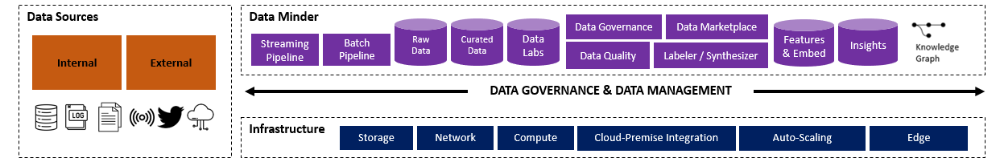
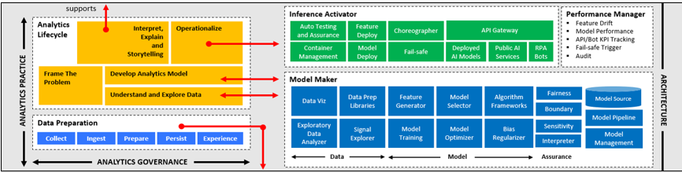
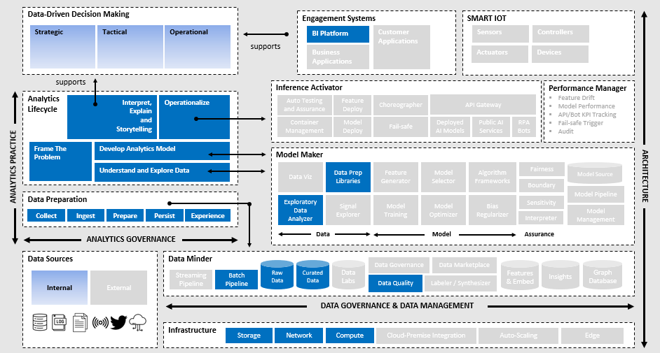
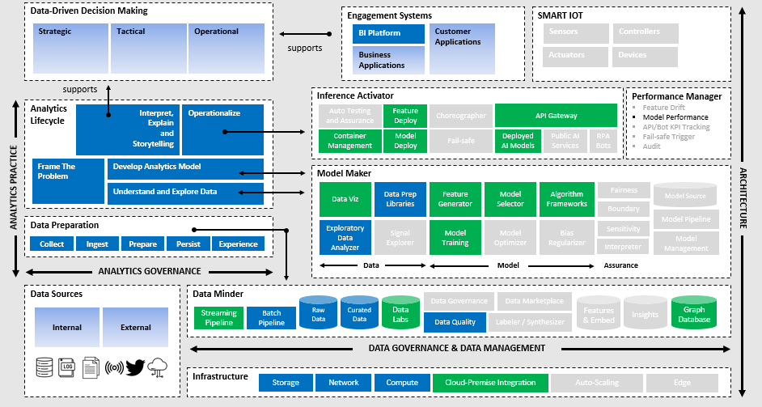
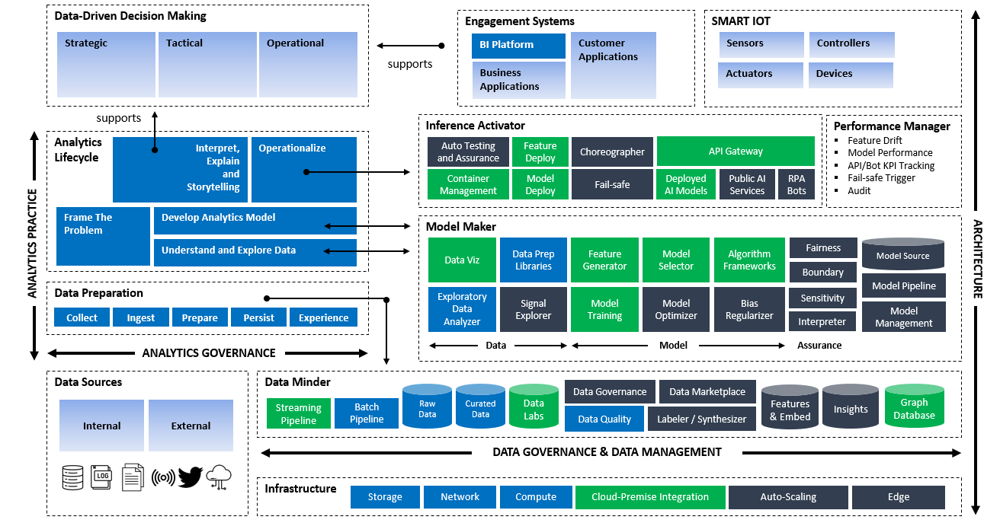

# Big Data Blueprint

## Reference Architecture

```{tabbed} Infrastructure and Data Minder


:::{dropdown} **Infrastructure**
:title: bg-jb-fernGreen text-light
:body: text-justify
:animate: fade-in-slide-down


High performance networking is typically required as large and fast data movement are expected. Infrastructure comprising storage, network and compute resources can be procured in any of the forms below:
* physical setup on-premise or service provider's data center
* Hypter-Converged Infrastructure (HCI) such as on-premise VMWare vSphere or Nutanix
* Infrastructure-as-a-Service (IaaS) available from cloud provider
* Platform-as-a-Service (PaaS) available from cloud provider
:::

:::{dropdown} **Data Minder**
:title: bg-jb-fernGreen text-light
:body: text-justify
:animate: fade-in-slide-down

Used to manage the integration and data of a platform. This component is where data is gathered and cleaned and where appropriate access to that data is controlled. Includes data lakes, databases, data files and data warehouses, with inputs both from information sources across the company and externally.</li><li>**Data Sources:** The primary locations from which data is collected first-hand. These could include the organization’s CRM, system, ERP system, order management system, logs from the customer website or mobile app, IOT devices or sensors, still or video cameras, wearables, or any other sources. Some of the data and integration layer may even be externally focused. These can come in through a batch or streaming pipeline.<br><br></li><li>**Raw Data Store:** Where all incoming data is stored without modification, whether the data is structured, which might mean it comes from a database table, including time series data, or unstructured, such as an image file from a drone or satellite, a video, or a Word document. The raw data store is meant to house data from the source system “as is, but validations are required to ensure it is consistent with data from the source system, including structure and format validation, record counts or profiling. Invalid data is flagged and stored for further analysis and correction.<br><br></li><li>**Data Labs:** Where the AI scientists pull in their data to use throughout the experimentation and modeling process. They then make any necessary changes, including transformation, bias reduction, scaling, or other data preparation steps needed before or during modeling. Data labs can be thought of as the development environments for the modelers, and there is at least one person, or a small team of people, working in each lab.<br><br></li><li>**Data Governance:** The data governance component manages the data governance and stewardship workflow and leverages the data quality component to understand the quality of the data and determine what actions are required to ensure that the uses of the data are consistent with corporate policies and applicable laws and regulations.<br><br></li><li>**Data Synthesizer:** Used to do two things; firstly, synthesizes new data for model experimentation when actual information is not yet available. Synthetic data is data that is generated programmatically, as opposed to real-world data, which is collected and secondly, it synthesizes data where there are privacy concerns about existing data. Synthetic data is generated with precisely controlled statistical distributions that reflect real-world scenarios. AI models trained on the synthetic data can eventually be retrained on the real-world data after they are collected.</li><li>**Data Labeler:** Used to label existing datasets to prepare them for supervised learning. The label is the target attribute that the machine learning algorithm tries to predict. This component manages a workflow for human labeling, but it may also have an automated labeling component. It serves the features to a suer who then enters a label. Can be done with structured data, audio, images and other data types.<br><br></li><li>**Knowledge Graph:** A graph of entities, relationships, and other information gathered from unstructured text data such as Word documents or PDF files. It is used to more efficiently and precisely locate information that was in the documents. Often there is more than one knowledge graph, depending on the purpose for which it was build – for example, to find answers asked of a virtual assistant about the expertise of people in a company or about company policies.<br><br></li><li>**Data Marketplace:** A comprehensive view of all the data and features available to AI scientists and other users. This information is easily browsable to enable users to understand what data is available and includes descriptions of the data, associated metadata, information on the relationships among the data elements, data lineage and so on. In many instances, available information also includes data profiles such as counts and distribution of the rows of data. AI scientists as well as business analysts, business users and business intelligence (BI) developers use the data marketplace to understand all the data that is available in the company.This data marketplace is key to enabling data literacy and culture of data driven decisions within a company.
:::
```
```{tabbed} Model Maker, Inference Activator and Performance Manager 
 
:::{dropdown} **Model Maker**
:title: bg-jb-fernGreen text-light
:body: text-justify
:animate: fade-in-slide-down

Also known as the experimentation layer, is where AI scientists develop, validate, and iterate their hypotheses. This layer needs to support them through training potentially hundreds of models before they arrive at the ideal one for a specific use case. Help through the model risk assessment for each model and in developing any necessary corrections. The model maker has three groups of components for AI scientists to use, for working with the data, for making the model and for model assurance.<br><br></li><li>**Data:** The data components in this layer are for AI scientists to use so they can understand their datasets before they can move on to the modeling steps. The data visualization component is a set of libraries that allow the user to easily create visualizations. The data preparation component is a set of libraries that help with data imputation for missing data and convert data to the right format for modeling. The exploratory data analyzer helps discover patterns, find anomalies, look for bias in the data, and understand various statistical summaries of the data. The signal explorer finds correlations in a dataset when it is given a data lake and a target data column to predict. It looks for which other features are correlated and are likely predictors for this target column. Other than time, the advantage of an automatic approach over a manual one is the ability to find unexpected patterns more easily.<br><br></li><li>**Model:** AI scientists use modeling components to develop their models. The algorithm frameworks include various types of algorithms that can be trained on the data to create models. Frameworks (scikit-learn, Tensorflow, PyTorch) are set up and managed here. These frameworks include algorithms that cover simulation and optimization, anomaly detection, pattern recognition, prediction, knowledge mining and potentially others.The feature generator creates and evaluates derived features generated by combining existing data features. It then determines whether this derived feature is predictive of the target or not. The feature generator is similar to the signal explorer, but it generates and evaluates derived features rather than just working on the base features. Model training includes different ways to configure the models and the different types of learning that can be leveraged. Modeling includes rules configuration for RPA, and inference engines,  batch training for machine learning and deep learning models, online training using reinforcement learning, distributed (or federated) learning for edge devices, or combinations of these. The bias regularizer is used in the modeling process during training to penalize models for high bias and low accuracy. This process ensures that bias Is managed and that the model does not simply optimize for redictive power irrespective of bias. It is part of the model risk governance. The model selector helps compare the performance of the different experiments to select the optimal one. The model optimizer helps tune the AI models’ hyperparameters for the best performance. It runs the model training and evaluation multiple times. It also tracks the metadata and uses optimization methods to find the optimal hyperparameter settings for model performance. Without this component, a great deal of time may be spent tuning hyperparameters manually, and this can make it challenging to find the best performing parameters.<br><br></li><li>**Assurance:** Help track models and changes to them to document which model experiments have previously been conducted and how to reproduce the results of an experiment accurately. This component uses configuration management tools to track such things as what features were tested and discarded, what modifications were made to data pipelines, and what compute resources were made available to support sufficient training. Together with configuration information, model management accelerates the consistent deployment of AI services while helping to reduce redundant work. The model source is the repository for all model code. The model pipeline is the component where the configurations for the model pipeline, from data to modeling to deployment are managed.
:::

:::{dropdown} **Performance Manager**
:title: bg-jb-fernGreen text-light
:body: text-justify
:animate: fade-in-slide-down

This performance manager monitors run-time AI models – models that are in active use. The feature drift component follows the data distribution of all the input data for each feature and compares it to the distribution known at the time of model training. If these distributions are sufficiently different (that is, they exceed some differential threshold), then the model may have to be retrained Drift is a leading indicator of any potential issues in model accuracy. The model performance component monitors whether a model’s output and predictions are still meeting a defined threshold. For example, is the model accuracy still at or above 90% Sometimes there is a time lag between when the model predicts something and when the predicted event occurs, so model performance is often a lagging indicator of a model’s fitness for use.
:::

:::{dropdown} **Inference Activator**
:title: bg-jb-fernGreen text-light
:body: text-justify
:animate: fade-in-slide-down

The inference activator deploys models into production and powers AI during run-time inferencing. The models are usually invoked through and API call from business applications using data that was not part of the model training and testing. Then the models are executed to make predictions. The continuous integration and continuous deployment (CI/CD), DevOps pipeline houses the tools that manage deployment, including automated testing and model assurance. This testing includes model validation to ensure model performance is as expected in each new environment; end-to-end testing  to validate that the data pipeline is accessible and APIs for the model are working; the model risk test, such as fairness, boundary condition, and sensitivity testing.</li><li>**Model Deployment:** The model deployment component packages and deploys the AI models, usually in containers to be used through APIs for real-time use, or within a data pipeline for use in batch mode. Containers are an open standard for packaging and distributing applications, including all software dependencies, so that the model can run quickly and reliably in any environment. They are in everyday use today for both model deployment and in deploying and scaling other kinds of software.<br><br></li><li>**Feature Deployment:** The feature deployment component deploys code for any feature transformations required on the input data. Sometimes this is integrated into model API, but sometimes it is separate from it.<br><br></li><li>**API Gateway:** For AI in run time, there is an API gateway that manages the set of APIs through which applications can invoke or trigger pretrained AI models. These include deployed AI models that were built on the platform and public AI services that are available from the large cloud providers, such as Microsoft Cognitive Services, a variety of startups, and many smaller companies. Lastly, RPA bots can also be accessed through the APIs as needed. The APIs are called by connected business applications that consume the model or from business intelligence applications that consume the present information in reports and dashboard. These applications usually have a human user. The APIs can also be enabled for different types of machines, consumption, such as autonomous systems that are synchronous or asynchronous but that have no human consumer. Sometimes the user interface of the application itself requires AI APIs, such as requests from conversational user interfaces in virtual assistants or for gesture control, eye-tracking, biometric recognition and ethomic (movement-based) interfaces.<br><br></li><li>**Choreographer:** The choreographer is configured when multiple models need to work in concert with each other. Sometimes this is handled inside business applications in the top layer; at other times, it is better to allow the model interactions to remain in the inference layer, depending on the specific use case. Some “intelligent products” are composite choreographs of multiple lower-level APIs – for example sentiment analysis from a voice file may include choreography among a speech-to-text API and various natural language processing (NLP) APIs.<br><br></li><li>**Failsafe and Container Management:** The failsafe component allows administrators to configure the failsafe mechanism for models for which such mechanisms have been deemed necessary. The container management component helps manage the deployed containers behind the model APIs and orchestrates the storage, networking and computing infrastructure to ensure the application is available. This is where the configurations are managed to scale the numbers of containers for a model based on CPU or GPU usage, accomplishing such tasks as restarting or replacing containers that fail.  
:::
```

## Analytics Programme
```{tabbed} Analytics Starter Programme
  
*Composable Architecture for Starter Programme*

:::{dropdown} **Data Minder**
:title: bg-jb-blue text-light
:body: text-left
:animate: fade-in-slide-down

| Function | Alpha Edge | Azure | Multi-Cloud
|-----------|------------|-------|--------
| Batch Pipeline |Cloud Data Migration| Data Factory | Airflow
| Raw Data Store |<li>Object Storage</li><li>GaussDB |<li>Azure Blob Storage</li>|<li>NFS</li><li>PostgreSQL</li> |
| Curated Data Store |GaussDB| Azure SQL Database | PostgreSQL |
| Data Quality | - | Azure Data Quality Services | Python / SQL
:::

:::{dropdown} **Model Maker**
:title: bg-jb-blue text-light
:body: text-left
:animate: fade-in-slide-down

| Function | Alpha Edge | Azure | Multi-Cloud
|----------|------------|-------|--------
| Data Prep Libraries |<li>Cloud Data Migration</li><li>Python / SQL | <li>Data Factory</li><li>Python / SQL |<li>Python / SQL</li>| 
| Exploratory Data Analyzer |<li>Data Lake Visualization</li>|<li>Metabase</li><li>Power BI |<li>Metabase</li>
:::

:::{dropdown} **Engagement Systems**
:title: bg-jb-blue text-light
:body: text-left
:animate: fade-in-slide-down

| Function | Alpha Edge | Azure | Multi-Cloud
|-----------|------------|-------|--------
| Business Intelligence Systems |<li>Metabase</li><li>Superset</li><li>Data Lake Visualization<br><br>**OLAP**</li><li>GaussDB |<li>Metabase</li><li>Superset</li><li>Power BI<br><br><br>**OLAP**</li><li>Azure Analysis Services |<li>Metabase</li><li>Superset</li><li>Tableu</li><br>**OLAP**</li><li>Druid | 
:::
```

```{tabbed} Analytics Growth Programme

*Composable Architecture for Analytics Growth Programme*

:::{dropdown} **Data Minder**
:title: bg-jb-green text-light
:body: text-left
:animate: fade-in-slide-down

| Function | Alpha Edge | Azure | Multi-Cloud | SAS Viya
|----------|------------|-------|-------------|-----------
| Streaming Pipeline | Distributed Message Service | Azure Event Hub | Kafka | SAS Event Stream Processing
| Batch Pipeline |Cloud Data Migration | Data Factory | Airflow | SAS Data Integration Studio
| Raw Data Store |<li>Object Storage Service</li><li>Map Reduce Service | <li>Azure Blob Storage</li>|<li>NFS</li><li>PostgreSQL | 
| Curated Data Store| Data Warehouse Service | Azure SQL Database | PostgreSQL |
| Data Quality | Cloud Data Migratopn | Azure Data FActory | Python | SAS Data Quality 
| Data Lab | ExeML | Azure Machine Learning | Jupyter Lab | SAS Studio
| Graph Database | Graph Engine Service |Azure Cosmos DB | Neo4J | 
:::
:::{dropdown} **Model Maker**
:title: bg-jb-green text-light
:body: text-left
:animate: fade-in-slide-down

| Function | Alpha Edge | Azure | Multi-Cloud | SAS Viya
|----------|------------|-------|-------------|-----------
| Data Viz | Data Lake Visualization |Power BI | Metabase | SAS Visual Analytics
| Data Prep Libraries|<li>Python / SQL</li>|<li>Data Factory</li><li>Python / SQL |<li>DBT</li><li>Airflow |<li>SAS Data Preparation</li>
| Exploratory Data Analyzer |<li>Model Arts DevEnviron</li>|<li>Metabase</li><li>Power BI |<li>Metabase</li>|<li>SAS Visual Statistics</li>
| Feature Generator | ModelArts Training Management | Azure Machine Learning | Anaconda | SAS VDMML
| Model Training | ModelArts Training Management | Azure Machine Learning | Anaconda | SAS VDMML
| Model Selector | ModelArts Training Management | Azure Machine Learning | Anaconda | SAS VDMML
| Algorithm Frameworks | ModelArts Training Management | Azure Machine Learning | Anaconda | SAS VDMML
:::
:::{dropdown} **Inference Activator**
:title: bg-jb-green text-light
:body: text-left
:animate: fade-in-slide-down

| Function | Alpha Edge | Azure | Multi-Cloud | SAS Viya
|----------|------------|-------|-------------|-----------
| Container Management | Cloud Container Engine | Azure Kubernetes Services | Ranches 
| Feature Deploy | Model Arts Model Management | Azure DevOps | Ray | SAS Model Manager
| Model Deploy | Model Arts Model Management | Azure DevOps | Ray | SAS Model Manager
| API Gateway | API Gateway | Azure API Management | FAST API | SAS Model Manager 
| Deploy AI Models | Model Arts Model Management | Azure DevOps | Ray | SAS Model Manager
:::
:::{dropdown} **Performance Manager**
:title: bg-jb-green text-light
:body: text-left
:animate: fade-in-slide-down

| Function | Alpha Edge | Azure | Multi-Cloud | SAS Viya
|----------|------------|-------|-------------|-----------
| Model Performance | Model Arts | Azure Machine Learning | Ray | SAS Model Manager
:::
:::{dropdown} **Engagement Systems**
:title: bg-jb-green text-light
:body: text-left
:animate: fade-in-slide-down

| Function | Alpha Edge | Azure | Multi-Cloud | SAS Viya
|----------|------------|-------|-------------|----------- 
| Business Intelligence Systems |<li>Metabase</li><li>Superset |<li>Metabase</li><li>Superset</li><li>Power BI |<li>Metabase</li><li>Superset |<li>SAS Visual Analytics</li>|
:::
```

```{tabbed} Analytics Advanced Programme

*Composable Architecture for Analytics Advanced Programme*

:::{dropdown} **Data Minder**
:title: bg-secondary text-light
:body: text-left
:animate: fade-in-slide-down

| Function | Alpha Edge | Azure | IBM CP4D (Multi-Cloud) | Cloudera CDP
|----------|------------|-------|------------------------|-----------
| Streaming Pipeline | Distributed Message Service | DaAzure Event Hub | Streams | Apache Kafka
| Batch Pipeline |<li>Cloud Data Migration |<li>Data Factory |<li>IBM DataStage |<li>Apache Sqoop</li><li>Apache Oozie
| Raw Data Store |<li>Object Storage</li><li>Map Reduce Service |<li>Azure Blob Storage</li><li>Azure Data Lake Gen 2 |<li>Red Hat Ceph Storage |<li>HDFS
| Curated Data Store |<li>Data Warehouse Service |<li>Azure SQL Database</li><li>Azure Data Lake Gen 2 |<li>IBM DB2 Warehouse |<li>Apache Hive</li><li>Apache HBase</li><li>Cloudera Impala
| Data Quality |<li>Cloud Data Migration |<li>Azure Data Factory |<li>Watson Knowledge Catalog |<li>Cloudera Shared Data Experience (SDX)
| Data Lab |<li>ExeML |<li>Azure Machine Learning |<li>Jupyter Notebook</li><li>RStudio Server |<li>Apache Zeppelin
| Data Governance | Data Lake Governance Center | Azure Purview | IBM DataStage | Cloudera Navigator
| Data Marketplace | Data Lake Catalog | Azure Data Catalog | WAtson Knowledge Catalog | Cloudera Shared Data Experience (SDX)
| Labeler/Synthesizer | ModelArts Data Management | Azure Machine Learning Data Labeling | IBM Cloud Annotations | Cloudera Active Learner 
| Features & Embed | Data Warehouse Service | Azure Data Lake Gen 2 | IBM DB2 Warehouse | HDFS
| Insights | Data Warehouse Service | Azure Data Lake Gen 2 | IB, DB2 Warehouse | HDFS
| Graph Database | Graph Engine Service | Azure Cosmos DB | IBM DB2 Graph | AllegroGraph |
:::

:::{dropdown} **Model Maker**
:title: bg-secondary text-light
:body: text-left
:animate: fade-in-slide-down

| Function | Alpha Edge | Azure | IBM CP4D<br>(Multi-Cloud) | Cloudera CDP
|----------|------------|-------|------------------------|-----------
| Data Viz | Data Lake Visualization | Power BI | Cognos Dashboards | Cloudera Data Visualization
| Data Prep Libraries |<li>Python / SQL |<li>Data Factory</li><li>Python/SQL |<li>IBM DataStage</li><li>IBM Data Refinery | Cloudera DataFlow
| Exploratory Data Analyzer |<li>Model Arts DevEnviron |<li>Azure Machine Learning |<li>Jupyter Notebook</li><li>RStudio Server | Cloudera HUE
| Signal Explorer | Model Arts Training Management | Azure Machine Learning | IBM Watson | Cloudera Data Analytics Studio
| Feature Generator | Model Arts Training Management | Azure Machine Learning | IBM Watson | Cloudera Data Analytics Studio
| Model Training | Model Arts Training Management | Azure Machine Learning | IBM Watson | Cloudera Data Analytics Studio
| Model Selector | Model Arts Training Management | Azure Machine Learning | IBM Watson | Cloudera Data Analytics Studio
| Model Optimizer | Model Arts Training Management | Azure Machine Learning | IBM Watson | Cloudera Data Analytics Studio
| Bias Reqularizer | Model Arts Training Management | Azure Machine Learning | IBM Watson | Cloudera Data Analytics Studio
| Fairness | Model Arts Training Management | Azure Machine Learning | IBM Watson | Cloudera Data Analytics Studio
| Boundary | Model Arts Training Management | Azure Machine Learning | IBM Watson | Cloudera Data Analytics Studio
| Sensitivity | Model Arts Training Management | Azure Machine Learning | IBM Watson | Cloudera Data Analytics Studio
| Interpreter | Model Arts Training Management | Azure Machine Learning | IBM Watson | Cloudera Data Analytics Studio
| Model Source | Model Arts Model Management | Azure DevOps | IBM Watson ModelOps | Cloudera Data Analytics Studio
| Model Pipeline | Model Arts Model Management | Azure DevOps | IBM Watson ModelOps | Cloudera Data Analytics Studio
| Model Management | Model Arts Model Management | Azure DevOps | IBM Watson ModelOps | Cloudera Data Analytics Studio
:::

:::{dropdown} **Inference Activator**
:title: bg-secondary text-light
:body: text-left
:animate: fade-in-slide-down

| Function | Alpha Edge | Azure | IBM CP4D<br>(Multi-Cloud) | Cloudera CDP
|----------|------------|-------|------------------------|-----------
| Auto Testing and Assurance | Model Arts Service Deployment | Azure DevOps | IBM Watson OpenScale | Cloudera Data Science Workbench
| Container Management | Cloud Container Engine | Azure Kubernetes Services | IBM Watson OpenScale | Cloudera Data Science Workshop
| Feature Deploy | Model Arts Service Deployment | Azure DevOps | IBM Watson OpenScale | Cloudera Data Science Workbench
| Model Deploy | Model Arts Service Deployment | Azure DevOps | IBM Watson OpenScale | Cloudera Data Science Workbench
| Choreographer | Model Arts Service Deployment | Azure DevOps | IBM Watson OpenScale | Cloudera Data Science Workbench
| Fail-safe | Model Arts Service Deployment | Azure DevOps | IBM Watson OpenScale | Cloudera Data Science Workbench
| API Gateway |API Gateway | Azure API Management | IBM Watson OpenScale | Cloudera Data Science Workbench
| Deploy AI Models | Model Arts Service Deployment | Azure DevOps | IBM Watson OpenScale | Cloudera Data Science Workbench
| Public AI Services |<li>ExeML Image Classification</li><li>ExeML Object Detection</li><li>ExeML Predictive Analytics</li><li>ExeML Sound Classification</li><li>ExeML Text Classification |<li>Azure Applied AI Services</li><li>Azure Cognitive Services</li><li>Face API<li><li>Azure Speech to Text</li><li>Azure Text to Speech |<li>IBM Watson Speech to Text</li><li>IBM Watson Text to Speech</li><li>IBM Watson Language Translator</li><li>IBM Watson Natural Language Classifier</li><li>IBM Watson Assistant |<li>Applied ML Protege
| RPA Bots |- |Power Automate |  - | -
:::

:::{dropdown} **Performance Manager**
:title: bg-secondary text-light
:body: text-left
:animate: fade-in-slide-down

| Function | Alpha Edge | Azure | IBM CP4D<br>(Multi-Cloud) | Cloudera CDP
|----------|------------|-------|------------------------|-----------
| Feature Drift | Model Arts Model Management | Azure Machine Learning | IBM Watson OpenScale | Cloudera Data Science Workbench
| Model Performance | Model Arts Model Management | Azure Machine Learning | IBM Watson OpenScale | Cloudera Data Science Workbench
| API/Bot KPI Tracking | Model Arts Model Management | Power Automate | IBM Watson OpenScale | Cloudera Data Science Workbench
| Fail-safe-Trigger | Model Arts Model Management | Azure Machine Learning | IBM Watson OpenScale | Cloudera Data Science Workbench
| Audit | Model Arts Model Management | Azure Machine Learning | IBM Watson OpenScale | Cloudera Data Science Workbench
:::

:::{dropdown} **Engagement Systems**
:title: bg-secondary text-light
:body: text-left
:animate: fade-in-slide-down

| Function | Alpha Edge | Azure | IBM CP4D (Multi-Cloud) | Cloudera CDP
|----------|------------|-------|------------------------|----------- 
|Business Intelligence Systems |<li>Metabase</li><li>Superset |<li>Metabase</li><li>Superset</li><li>Power BI | Cognos Analytics | 
:::