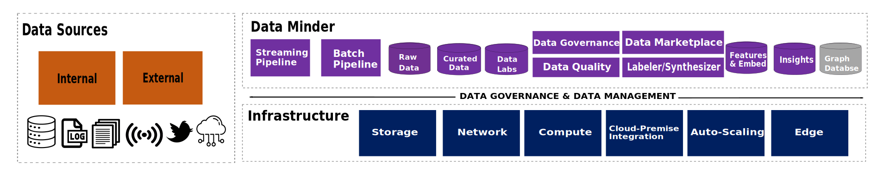
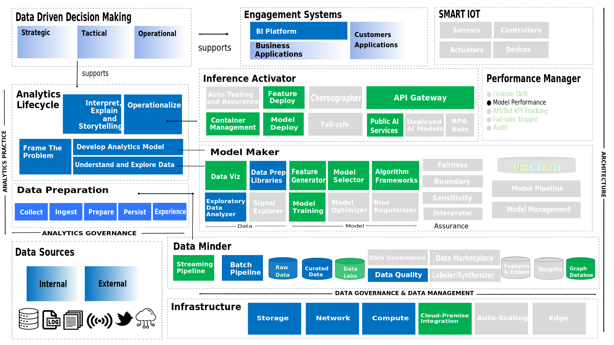
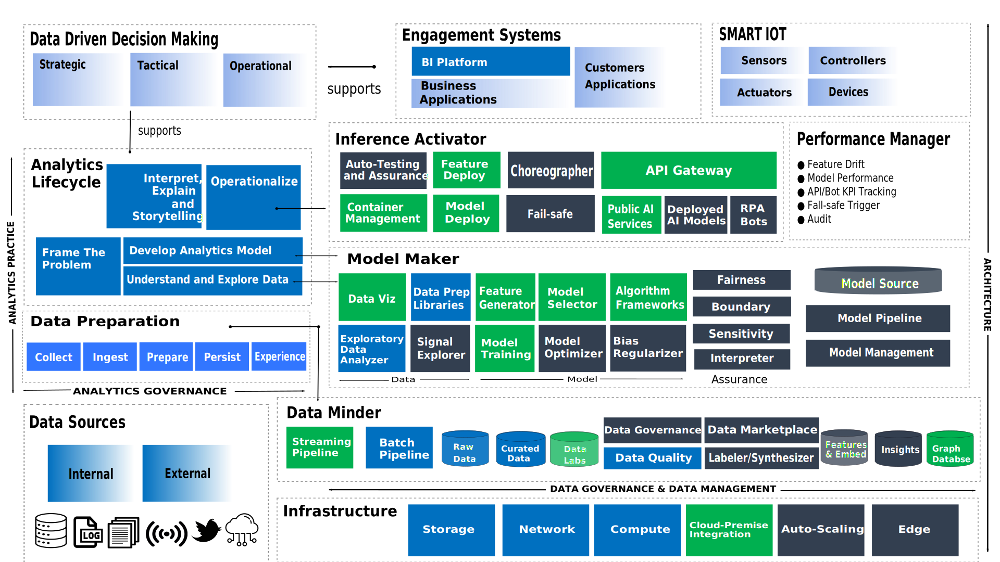

# Big Data Blueprint

## Reference Architecture

::::{tabbed} Infrastructure and Data Minder

:::{dropdown} **Infrastructure**
:title: bg-jb-four text-light
:body: text-justify
:animate: fade-in-slide-down

High performance networking is typically required as large and fast data movement are expected. Infrastructure comprising storage, network and compute resources can be procured in any of the forms below:
* physical setup on-premise or service provider's data center
* Hypter-Converged Infrastructure (HCI) such as on-premise VMWare vSphere or Nutanix
* Infrastructure-as-a-Service (IaaS) available from cloud provider
* Platform-as-a-Service (PaaS) available from cloud provider
:::

:::{dropdown} **Data Minder**
:title: bg-jb-four text-light
:body: text-justify
:animate: fade-in-slide-down

Used to manage the</li><li>**Data Sources:** The primary locations  </li><li>**Raw Data Store:** Where all incoming data  </li><li>**Data Labs:** Where the AI scientists  </li><li>**Data Governance:** The data governance  </li><li>**Data Synthesizer:** Used to do two things;</li><li>**Data Labeler:** Used to label  </li><li>**Knowledge Graph:** A graph of  </li><li>**Data Marketplace:** A comprehensive view 
:::
::::

::::{tabbed} Model Maker, Inference Activator and Performance Manager 
 

:::{dropdown} **Model Maker**
:title: bg-jb-four text-light
:body: text-justify
:animate: fade-in-slide-down

Also known as<li>**Data:** The data components </li><li>**Model:** AI scientists use modeling components </li><li>**Assurance:** Help track models.
:::

:::{dropdown} **Performance Manager**
:title: bg-jb-four text-light
:body: text-justify
:animate: fade-in-slide-down

This performance manager monitors 
:::

:::{dropdown} **Inference Activator**
:title: bg-jb-four text-light
:body: text-justify
:animate: fade-in-slide-down

The inference activator deploys</li><li>**Model Deployment:** The model deployment  </li><li>**Feature Deployment:** The feature deployment.  </li><li>**API Gateway:** For AI in run time  </li><li>**Choreographer:** The choreographer is configured   </li><li>**Failsafe and Container Management:** The failsafe component.
:::
::::

## Analytics Programme
::::{tabbed} Analytics Starter Programme
  
*Composable Architecture for Starter Programme*

:::{dropdown} **Data Minder**
:title: bg-jb-one text-light
:body: text-left
:animate: fade-in-slide-down

| Function | Alpha Edge | Azure | Multi-Cloud
|-----------|------------|-------|--------
| Batch Pipeline |Cloud Data Migration| Data Factory | Airflow
| Raw Data Store |<li>Object Storage</li><li>GaussDB |<li>Azure Blob Storage</li>|<li>NFS</li><li>PostgreSQL</li>|
| Curated Data Store |GaussDB| Azure SQL Database | PostgreSQL |
| Data Quality | ❌ | Azure Data Quality Services | Python / SQL
:::

:::{dropdown} **Model Maker**
:title: bg-jb-one text-light
:body: text-left
:animate: fade-in-slide-down

| Function | Alpha Edge | Azure | Multi-Cloud
|----------|------------|-------|--------
| Data Prep Libraries |<li>Cloud Data Migration</li><li>Python / SQL | <li>Data Factory</li><li>Python / SQL |<li>Python / SQL</li>| 
| Exploratory Data Analyzer |<li>Data Lake Visualization</li>|<li>Metabase</li><li>Power BI|<li>Metabase</li>
:::

:::{dropdown} **Engagement Systems**
:title: bg-jb-one text-light
:body: text-left
:animate: fade-in-slide-down

| Function | Alpha Edge | Azure | Multi-Cloud
|-----------|------------|-------|--------
| Business Intelligence Systems |<li>Metabase</li><li>Superset</li><li>Data Lake Visualization  **OLAP**</li><li>GaussDB |<li>Metabase</li><li>Superset</li><li>Power BI   **OLAP**</li><li>Azure Analysis Services|<li>Metabase</li><li>Superset</li><li>Tableu</li>  **OLAP**</li><li>Druid | 
:::
::::

::::{tabbed} Analytics Growth Programme

*Composable Architecture for Analytics Growth Programme*

:::{dropdown} **Data Minder**
:title: bg-jb-green text-light
:body: text-left
:animate: fade-in-slide-down

| Function | Alpha Edge | Azure | Multi-Cloud | SAS Viya
|----------|------------|-------|-------------|-----------
| Streaming Pipeline | Distributed Message Service | Azure Event Hub | Kafka | SAS Event Stream Processing
| Batch Pipeline |Cloud Data Migration | Data Factory | Airflow | SAS Data Integration Studio
| Raw Data Store |<li>Object Storage Service</li><li>Map Reduce Service|<li>Azure Blob Storage</li>|<li>NFS</li><li>PostgreSQL|❌ 
| Curated Data Store| Data Warehouse Service | Azure SQL Database | PostgreSQL | 
| Data Quality | Cloud Data Migratopn | Azure Data FActory | Python | SAS Data Quality 
| Data Lab | ExeML | Azure Machine Learning | Jupyter Lab | SAS Studio
| Graph Database | Graph Engine Service |Azure Cosmos DB | Neo4J | ❌
:::

:::{dropdown} **Model Maker**
:title: bg-jb-green text-light
:body: text-left
:animate: fade-in-slide-down

| Function | Alpha Edge | Azure | Multi-Cloud | SAS Viya
|----------|------------|-------|-------------|-----------
| Data Viz | Data Lake Visualization |Power BI | Metabase | SAS Visual Analytics
| Data Prep Libraries|<li>Python / SQL</li>|<li>Data Factory</li><li>Python / SQL |<li>DBT</li><li>Airflow |<li>SAS Data Preparation</li>
| Exploratory Data Analyzer |<li>Model Arts DevEnviron</li>|<li>Metabase</li><li>Power BI | Metabase|<li>SAS Visual Statistics</li>
| Feature Generator | ModelArts Training Management | Azure Machine Learning | Anaconda | SAS VDMML
| Model Training | ModelArts Training Management | Azure Machine Learning | Anaconda | SAS VDMML
| Model Selector | ModelArts Training Management | Azure Machine Learning | Anaconda | SAS VDMML
| Algorithm Frameworks | ModelArts Training Management | Azure Machine Learning | Anaconda | SAS VDMML
:::

:::{dropdown} **Inference Activator**
:title: bg-jb-green text-light
:body: text-left
:animate: fade-in-slide-down

| Function | Alpha Edge | Azure | Multi-Cloud | SAS Viya
|----------|------------|-------|-------------|-----------
| Container Management | Cloud Container Engine | Azure Kubernetes Services | Ranches 
| Feature Deploy | Model Arts Model Management | Azure DevOps | Ray | SAS Model Manager
| Model Deploy | Model Arts Model Management | Azure DevOps | Ray | SAS Model Manager
| API Gateway | API Gateway | Azure API Management | FAST API | SAS Model Manager 
| Deploy AI Models | Model Arts Model Management | Azure DevOps | Ray | SAS Model Manager
:::

:::{dropdown} **Performance Manager**
:title: bg-jb-green text-light
:body: text-left
:animate: fade-in-slide-down

| Function | Alpha Edge | Azure | Multi-Cloud | SAS Viya
|----------|------------|-------|-------------|-----------
| Model Performance | Model Arts | Azure Machine Learning | Ray | SAS Model Manager
:::

:::{dropdown} **Engagement Systems**
:title: bg-jb-green text-light
:body: text-left
:animate: fade-in-slide-down

| Function | Alpha Edge | Azure | Multi-Cloud | SAS Viya
|----------|------------|-------|-------------|----------- 
| Business Intelligence Systems |<ul><li>Metabase<li>Superset</ul>|<ul><li>Metabase<li>Superset</li><li>Power BI |<ul><li>Metabase</li><li>Superset |<li>SAS Visual Analytics</li>|
:::
::::

::::{tabbed} Analytics Advanced Programme

*Composable Architecture for Analytics Advanced Programme*

:::{dropdown} **Data Minder**
:title: bg-secondary text-light
:body: text-left
:animate: fade-in-slide-down

| Function | Alpha Edge | Azure | IBM CP4D (Multi-Cloud) | Cloudera CDP
|----------|------------|-------|------------------------|-----------
| Streaming Pipeline | Distributed Message Service | DaAzure Event Hub | Streams | Apache Kafka
| Batch Pipeline |<li>Cloud Data Migration |<li>Data Factory |<li>IBM DataStage |<li>Apache Sqoop</li><li>Apache Oozie
| Raw Data Store |<li>Object Storage</li><li>Map Reduce Service |<li>Azure Blob Storage</li><li>Azure Data Lake Gen 2 |<li>Red Hat Ceph Storage |<li>HDFS
| Curated Data Store |<li>Data Warehouse Service |<li>Azure SQL Database</li><li>Azure Data Lake Gen 2 |<li>IBM DB2 Warehouse |<li>Apache Hive</li><li>Apache HBase</li><li>Cloudera Impala
| Data Quality |<li>Cloud Data Migration |<li>Azure Data Factory |<li>Watson Knowledge Catalog |<li>Cloudera Shared Data Experience (SDX)
| Data Lab |<li>ExeML |<li>Azure Machine Learning |<li>Jupyter Notebook</li><li>RStudio Server |<li>Apache Zeppelin
| Data Governance | Data Lake Governance Center | Azure Purview | IBM DataStage | Cloudera Navigator
| Data Marketplace | Data Lake Catalog | Azure Data Catalog | WAtson Knowledge Catalog | Cloudera Shared Data Experience (SDX)
| Labeler/Synthesizer | ModelArts Data Management | Azure Machine Learning Data Labeling | IBM Cloud Annotations | Cloudera Active Learner 
| Features & Embed | Data Warehouse Service | Azure Data Lake Gen 2 | IBM DB2 Warehouse | HDFS
| Insights | Data Warehouse Service | Azure Data Lake Gen 2 | IB, DB2 Warehouse | HDFS
| Graph Database | Graph Engine Service | Azure Cosmos DB | IBM DB2 Graph | AllegroGraph |
:::

:::{dropdown} **Model Maker**
:title: bg-secondary text-light
:body: text-left
:animate: fade-in-slide-down

| Function | Alpha Edge | Azure | IBM CP4D (Multi-Cloud) | Cloudera CDP
|----------|------------|-------|------------------------|-----------
| Data Viz | Data Lake Visualization | Power BI | Cognos Dashboards | Cloudera Data Visualization
| Data Prep Libraries |<li>Python / SQL |<li>Data Factory</li><li>Python/SQL |<li>IBM DataStage</li><li>IBM Data Refinery | Cloudera DataFlow
| Exploratory Data Analyzer |<li>Model Arts DevEnviron |<li>Azure Machine Learning |<li>Jupyter Notebook</li><li>RStudio Server | Cloudera HUE
| Signal Explorer | Model Arts Training Management | Azure Machine Learning | IBM Watson | Cloudera Data Analytics Studio
| Feature Generator | Model Arts Training Management | Azure Machine Learning | IBM Watson | Cloudera Data Analytics Studio
| Model Training | Model Arts Training Management | Azure Machine Learning | IBM Watson | Cloudera Data Analytics Studio
| Model Selector | Model Arts Training Management | Azure Machine Learning | IBM Watson | Cloudera Data Analytics Studio
| Model Optimizer | Model Arts Training Management | Azure Machine Learning | IBM Watson | Cloudera Data Analytics Studio
| Bias Reqularizer | Model Arts Training Management | Azure Machine Learning | IBM Watson | Cloudera Data Analytics Studio
| Fairness | Model Arts Training Management | Azure Machine Learning | IBM Watson | Cloudera Data Analytics Studio
| Boundary | Model Arts Training Management | Azure Machine Learning | IBM Watson | Cloudera Data Analytics Studio
| Sensitivity | Model Arts Training Management | Azure Machine Learning | IBM Watson | Cloudera Data Analytics Studio
| Interpreter | Model Arts Training Management | Azure Machine Learning | IBM Watson | Cloudera Data Analytics Studio
| Model Source | Model Arts Model Management | Azure DevOps | IBM Watson ModelOps | Cloudera Data Analytics Studio
| Model Pipeline | Model Arts Model Management | Azure DevOps | IBM Watson ModelOps | Cloudera Data Analytics Studio
| Model Management | Model Arts Model Management | Azure DevOps | IBM Watson ModelOps | Cloudera Data Analytics Studio
:::

:::{dropdown} **Inference Activator**
:title: bg-secondary text-light
:body: text-left
:animate: fade-in-slide-down

| Function | Alpha Edge | Azure | IBM CP4D (Multi-Cloud) | Cloudera CDP
|----------|------------|-------|------------------------|-----------
| Auto Testing and Assurance | Model Arts Service Deployment | Azure DevOps | IBM Watson OpenScale | Cloudera Data Science Workbench
| Container Management | Cloud Container Engine | Azure Kubernetes Services | IBM Watson OpenScale | Cloudera Data Science Workshop
| Feature Deploy | Model Arts Service Deployment | Azure DevOps | IBM Watson OpenScale | Cloudera Data Science Workbench
| Model Deploy | Model Arts Service Deployment | Azure DevOps | IBM Watson OpenScale | Cloudera Data Science Workbench
| Choreographer | Model Arts Service Deployment | Azure DevOps | IBM Watson OpenScale | Cloudera Data Science Workbench
| Fail-safe | Model Arts Service Deployment | Azure DevOps | IBM Watson OpenScale | Cloudera Data Science Workbench
| API Gateway |API Gateway | Azure API Management | IBM Watson OpenScale | Cloudera Data Science Workbench
| Deploy AI Models | Model Arts Service Deployment | Azure DevOps | IBM Watson OpenScale | Cloudera Data Science Workbench
| Public AI Services |<li>ExeML Image Classification</li><li>ExeML Object Detection</li><li>ExeML Predictive Analytics</li><li>ExeML Sound Classification</li><li>ExeML Text Classification |<li>Azure Applied AI Services</li><li>Azure Cognitive Services</li><li>Face API<li><li>Azure Speech to Text</li><li>Azure Text to Speech |<li>IBM Watson Speech to Text</li><li>IBM Watson Text to Speech</li><li>IBM Watson Language Translator</li><li>IBM Watson Natural Language Classifier</li><li>IBM Watson Assistant |<li>Applied ML Protege
| RPA Bots |❌ |Power Automate |  ❌ | ❌
:::

:::{dropdown} **Performance Manager**
:title: bg-secondary text-light
:body: text-left
:animate: fade-in-slide-down

| Function | Alpha Edge | Azure | IBM CP4D (Multi-Cloud) | Cloudera CDP
|----------|------------|-------|------------------------|-----------
| Feature Drift | Model Arts Model Management | Azure Machine Learning | IBM Watson OpenScale | Cloudera Data Science Workbench
| Model Performance | Model Arts Model Management | Azure Machine Learning | IBM Watson OpenScale | Cloudera Data Science Workbench
| API/Bot KPI Tracking | Model Arts Model Management | Power Automate | IBM Watson OpenScale | Cloudera Data Science Workbench
| Fail-safe-Trigger | Model Arts Model Management | Azure Machine Learning | IBM Watson OpenScale | Cloudera Data Science Workbench
| Audit | Model Arts Model Management | Azure Machine Learning | IBM Watson OpenScale | Cloudera Data Science Workbench
:::

:::{dropdown} **Engagement Systems**
:title: bg-secondary text-light
:body: text-left
:animate: fade-in-slide-down

| Function | Alpha Edge | Azure | IBM CP4D (Multi-Cloud) | Cloudera CDP
|----------|------------|-------|------------------------|----------- 
|Business Intelligence Systems |<ul><li>Metabase<li>Superset</ul> |<ul><li>Metabase</li><li>Superset</li><li>Power BI</ul>| Cognos Analytics | ❌
:::
::::