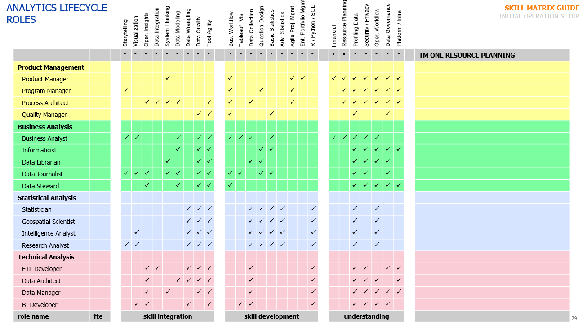

# Data Governance

*The data governance component manages the data governance and stewardship workflow and leverages the data quality of the data and determine what actions are required to ensure that the use of the data are consistent with corporate policies and applicable laws and regulations.*  

:::{figure-md} markdown-fig

Analytics Lifecycle Roles
:::

## Roles Definition 

| Product Management | Business Analysis | Statistical Analysis |  Techincal Analysis
|--------------------|-------------------|----------------------|----------------------
| 1\. Product Manager </li><li>Owns the analytics or data product and ensures that it is deployed, maintained, updated and reevaluated in alignment with organization needs for insights</li><li>Responsible for delivery, managing scope, cost and schedule of data products. This also referred to as a protfolio manager in some cases | 1\. Business Analyst </li><li>An analyst who is tasked with understanding business change needs, assessing the business impact of those changes, documenting requirements and analyzing and visualizing business data as part of a communication strategy with relevant stakeholders. | 1\. Data Statistician</li><li>Uses data engineering, mathematical, statistical, and programming skills to extract sound insights from a wide variety and volume of business data | 1\. Data Manager </li><li>Manages and maintains data based on a complete understanding of enterprise relationships, business definitions and business usage profiles</li><li>Ensure that information is organized, maintained and stored in a manner that facilitates business enablement and intelligence.
| 2\. Program Manager </li><li>Uses well-known project management methodology to support projects and project portfolios so that they meet their goals</li><li>Supports the management of scope, cost, schedule and escalation when deviations arise.  | 2\. Informaticist </li><li>One who captures, communicates and uses data and business or domain knowledge to drive the development, maintenance, optimization and approriate usage of information technology | 2\. Geospatial Scientist</li><li>Uses geographic information systems to analyze business data that can be tied to concepts of location and space as they change over time. | 2\. Data Architect</li><li>Recommends and initiates the creation of data structures, data models, relationship, attributes, values and schemas</li><li>Understand the implications of architectural design on different arms of the business.
| 3\. Process Architect </Li><li>Identifies current process state, elicits attributes, document all details and facilitates stakeholder consensus regarding new business process designs</li><li>Identifies impact and linkages between data products, user behaviour, real-world workflow and business policies. | 3\. Data Librarian</li><li>A specialist in knowledge management who organizes, documents and curates information regarding the body of data and analytics products in use by the business. | 3\. Intelligence Analyst</li><li>Performs a variety of simple and complex statistical activities to provide business entities with insights to maintain, improve or transform business activities. | 3\. ETL Developer</li><li>Develops programmatic solutions in response to technical needs such that they meet requirements and design specifications</li><li>Technical in nature, these roles often sit in IT and can also be referred to as data engineer, data analyst or data integrators.
| 4\. Quality Manager </li><li>Responsible for ensuring that analytics products are developed using best practices for quality assurance</li><li>Tasked with the maintenance and durability of the analytics products and its overall lifespan of usefulness.| 4\. Data Journalist</li><li>A writer who interprets, critiques and reformulates data and analytics results such that they can be put into the context of a business story for nontechnical stakeholders. | 4\. Research Analyst</li><li>Carries out a variety of simple and complex data analysis tasks in support of research that seeks to answer a question related to the organization. | 4\. BI Developer/ Report Writer</li><li>Develops the framework for organizing the data, information management, and technology components used to build enterprise systems for both reporting and the socialization of analytics results.
| 5\. Data Steward</li><li>The person who managed and oversees a particular domain of business data to ensure that data consumers have high-quality data elements that are created and made accessible in a consistent, predictable manner.

